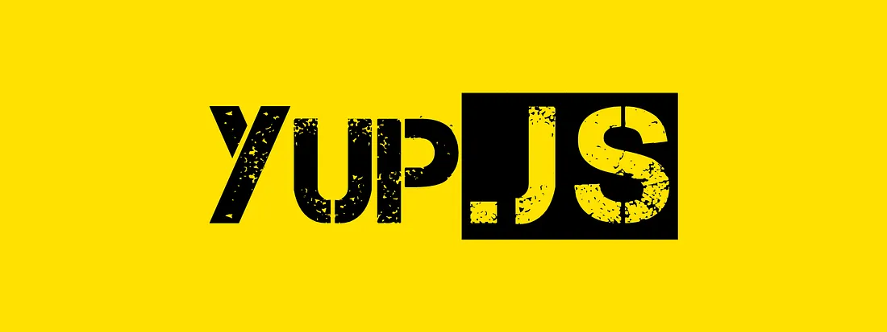

<h1 align="center" style="color: #2222ec; font-family: Roboto Mono,Consolas,Liberation Mono,Courier New,Courier,monospace;
    font-size: 55px;
    font-weight: 700;">
APE NFT APP <p style="color: yellow">lending on react...</p> 
</h1>

<div align="center" color="#694e04" style="color: #694e04; font-family: Roboto Mono,Consolas,Liberation Mono,Courier New,Courier,monospace;
    font-size: 22px;
    font-weight: 500;">
Ape NFT it's a Story that started with one simple ape WHO GOT FED UP WITH BORING AND HYPOCRITIC COMMONPLACE THIS IS HOW THE IDEA OF
ESCAPING AND DYNAMIC JOURNEY ON THEYACHT. EACH ARTWORK IN THE COLLECTION TELLS A STORY OF ONE JOURNEY. ARTS ARE RANDOMLY GENERATED BY USERS
</div>
<div align='center'>

</div>

---

<div align="center">

</div>

<div align="center" style="margin-left: auto; margin-right: auto; width: fit-content;">
<a></a>
<a></a>
<a></a>
<a></a>
<a></a>
<a></a>
<a></a>
</div>

---

<div align="center">
<h3>BASE Live URL: <a href="https://ljuzifer.github.io/ape-project/" target="_blank" rel="noreferrer noopener">ape-project</a></h3>
</div>

---

## Content

-   [TS & Mockup](#TS)
-   [Technologies](#Technologies)
-   [Development](#Development)
-   [Project Developer](#Developer)

---

## TS

-   [TS](https://docs.google.com/document/d/1U3BNnY61mQnyvSC_dphAVgYDP1omhO4g/edit#heading=h.75qiissueht4)
-   [Design Mockup](https://www.figma.com/file/NhwvCnRetLh4PsJY3rD2d6/Ape-NFT?type=design&node-id=51%3A952&mode=design&t=FRLZSC6KhEuOSkVs-1)

## Technologies

-   [HTML5]
-   [CSS3]
-   [JavaScript]
-   [React]
-   [React DOM]
-   [Formik]
-   [Yup]
-   [useMedia]
-   [React-Slick]
-   [Styled-Components]

---

## Development

### Clone this repository to your local machine:

To clone repo, run the following command:

`git clone` [tap!](https://github.com/Ljuzifer/ape-project.git)

### Installing Dependencies

To install dependencies, run the following command:

```sh
$ npm i
```

### Running the Development Server

To run the dev server, run the following command:

```sh
$ npm start
```

---

## Developer

<div align="center">
  
</div>

<div align="center">
  <h4>Created by &copy; Ljuzifer</h4>
  <a href="https://www.linkedin.com/in/ljuzifer/" target="_blank" rel="noopener norefferer">
    
  </a>
</div>
<div align='center'>
<a href="https://t.me/Ljuzifer" target="_blank" rel="noreferrer"> 
<picture> 
 
</picture> 
</a>
<a href="mailto:ljuzifer@gmail.com" target="_blank" rel="noreferrer"> 
<picture> 
 
</picture> 
</a>
</div>
